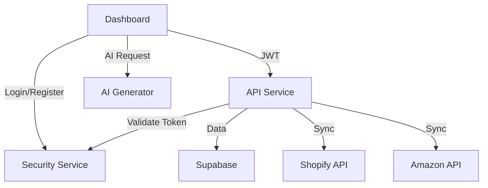

# 🏗️ ShopMarkets Microservices Architecture

**Version:** 2.0  
**Datum:** 2026-01-05  
**Status:** Production Ready

---

## 📋 Übersicht

ShopMarkets ist eine E-Commerce Cockpit-Plattform, die Händlern ermöglicht, alle ihre Online-Shops zentral zu verwalten.

### Architektur-Prinzipien

- **Microservices:** Jeder Service ist eigenständig deploybar
- **API-First:** Alle Services kommunizieren via REST APIs
- **Self-Hosted:** Komplette Kontrolle über Daten und Infrastruktur
- **Scalable:** Jeder Service kann unabhängig skaliert werden
- **Secure:** JWT-basierte Authentifizierung mit 2FA

---

## 🎯 Services

### 1. Security Service (`security.shopmarkets.app`)

**Zweck:** Zentrale Authentifizierung und Autorisierung

**Features:**
- User Registration/Login
- **Eigene 2FA-Implementierung** (Email-basiert, später TOTP)
- JWT Token Management
- Session Handling
- Password Reset

**Tech Stack:**
- Node.js + Express
- PostgreSQL (User DB)
- Nodemailer (Email)
- bcrypt + JWT

**Endpoints:**
```
POST   /api/auth/register
POST   /api/auth/login
POST   /api/auth/verify-2fa
POST   /api/auth/refresh-token
POST   /api/auth/logout
GET    /api/auth/me
```

---

### 2. API Service (`api.shopmarkets.app`)

**Zweck:** Business Logic und Daten-Management

**Features:**
- Shop-Integration (Shopify, Amazon, Kaufland)
- Produkt-Synchronisation
- Bestellungs-Management
- AVV-Vertrag Management
- Firmenprofil CRUD
- Billing/Subscription

**Tech Stack:**
- Node.js + Express
- Supabase (PostgreSQL) - Neue Instanz
- Shop-APIs (Shopify SDK, Amazon MWS, etc.)

**Endpoints:**
```
# Connections
GET    /api/connections
POST   /api/connections
DELETE /api/connections/:id

# Products
GET    /api/products
POST   /api/products
PUT    /api/products/:id
DELETE /api/products/:id

# Sync
POST   /api/sync/trigger
GET    /api/sync/logs

# Profile
GET    /api/profile
PUT    /api/profile
POST   /api/profile/avv-sign
```

---

### 3. Dashboard (`start.shopmarkets.app`)

**Zweck:** Haupt-Frontend für Händler

**Features:**
- Cockpit Interface
- Produkt-Verwaltung
- Shop-Verbindungen
- Analytics Dashboard
- Profil-Einstellungen

**Tech Stack:**
- React + TypeScript
- Vite
- TailwindCSS
- Zustand (State Management)
- React Router

**Bestehende Komponenten (wiederverwendet):**
- `Dashboard.tsx`
- `ProductsPage.tsx`
- `Connections.tsx`
- `Settings.tsx`
- `Billing.tsx`
- `AVVModal.tsx`
- `Onboarding.tsx`

---

### 4. AI Generator (`ai-generator.shopmarkets.app`)

**Zweck:** KI-gestützte Content-Erstellung

**Features:**
- SEO-Text Generation
- AI Image Creation
- Meta-Tags/Descriptions
- Product Descriptions

**Tech Stack:**
- Python + FastAPI
- OpenAI API
- Stable Diffusion (optional)

**Endpoints:**
```
POST   /api/generate/text
POST   /api/generate/image
POST   /api/generate/meta-tags
```

---

### 5. Landing Page (`www.shopmarkets.com`)

**Zweck:** Marketing Website

**Features:**
- Feature Showcase
- Pricing
- Blog
- Contact

**Tech Stack:**
- Next.js (Static Site)
- TailwindCSS

---

### 6. Marketplace (`shop-markets.com`)

**Zweck:** Partner-Produkte Verkauf

**Features:**
- Produkt-Katalog
- Warenkorb
- Checkout
- Partner-Verwaltung

**Tech Stack:**
- Next.js + Commerce.js
- Stripe/PayPal

---

## 🗄️ Datenbank-Architektur

### Security DB (PostgreSQL)
```
users
  - id (UUID)
  - email
  - password_hash
  - full_name
  - is_verified
  - is_active
  - avv_accepted_at
  - profile_completed
  - created_at

verification_codes
  - id (UUID)
  - user_id (FK)
  - code
  - type (email_verification, 2fa_login, password_reset)
  - expires_at
  - used_at

sessions
  - id (UUID)
  - user_id (FK)
  - refresh_token
  - expires_at
```

### Supabase DB (PostgreSQL)
```
connections
  - id (UUID)
  - user_id (FK)
  - platform (shopify, amazon, kaufland)
  - shop_name
  - api_credentials (encrypted)
  - status
  - last_sync_at

products
  - id (UUID)
  - user_id (FK)
  - connection_id (FK)
  - sku
  - title
  - description
  - price
  - stock
  - images
  - synced_at

sync_logs
  - id (UUID)
  - connection_id (FK)
  - status
  - items_synced
  - errors
  - started_at
  - completed_at

profiles
  - user_id (FK - Security DB)
  - company_name
  - address
  - phone
  - billing_info
```

---

## 🔐 Authentifizierung Flow

```
1. User registriert sich → Security Service
2. Email-Verification Code gesendet
3. User verifiziert Email
4. User loggt sich ein → Security Service
5. 2FA Code per Email gesendet
6. User gibt Code ein
7. JWT Token generiert (Access + Refresh)
8. Dashboard erhält Token
9. Dashboard ruft API Service auf (mit JWT Header)
10. API Service validiert Token bei Security Service
11. Daten werden zurückgegeben
```

---

## 🚀 Deployment

### Infrastruktur
- **Hosting:** Hetzner VPS (Coolify)
- **SSL:** Automatisch via Coolify/Let's Encrypt
- **CI/CD:** GitHub → Coolify Auto-Deploy

### Port-Konfiguration (Neue Supabase)
```
Studio:     3001
Kong:       8001
Auth:       9100
REST:       3001
Meta:       8082
Realtime:   4001
Storage:    5001
```

### Environment Variables (Coolify)

**Security Service:**
```
PORT=3001
DB_HOST=security-db
DB_PORT=5432
DB_NAME=security
DB_USER=postgres
DB_PASSWORD=<generated>
JWT_SECRET=<generated>
SMTP_HOST=smtp.ionos.de
SMTP_PORT=587
SMTP_USER=support@shopmarkets.app
SMTP_PASS=<secret>
CORS_ORIGIN=https://start.shopmarkets.app
```

**API Service:**
```
PORT=3000
SUPABASE_URL=http://supabase-kong:8001
SUPABASE_ANON_KEY=<generated>
SUPABASE_SERVICE_KEY=<generated>
SECURITY_SERVICE_URL=https://security.shopmarkets.app
SHOPIFY_API_KEY=<secret>
AMAZON_MWS_KEY=<secret>
```

**Dashboard:**
```
VITE_API_URL=https://api.shopmarkets.app
VITE_SECURITY_URL=https://security.shopmarkets.app
```

---

## 📦 Repository-Struktur

```
shopmarkets-mono/
├── services/
│   ├── security/          → security.shopmarkets.app
│   ├── api/               → api.shopmarkets.app
│   ├── dashboard/         → start.shopmarkets.app
│   ├── ai-generator/      → ai-generator.shopmarkets.app
│   ├── landing/           → www.shopmarkets.com
│   └── marketplace/       → shop-markets.com
├── infrastructure/
│   ├── supabase/          → Docker Compose
│   └── coolify/           → Deployment Configs
└── docs/
    └── ARCHITECTURE.md    → This file
```

---

## 🔄 Service Communication



---

## ✅ Next Steps

1. ✅ Architektur definiert
2. ⏳ Security Service erstellen
3. ⏳ API Service refactoren
4. ⏳ Supabase mit Custom Ports deployen
5. ⏳ Dashboard anpassen
6. ⏳ Coolify Deployment
7. ⏳ Testing & Go-Live

---

**Erstellt:** 2026-01-05  
**Autor:** ShopMarkets Team
